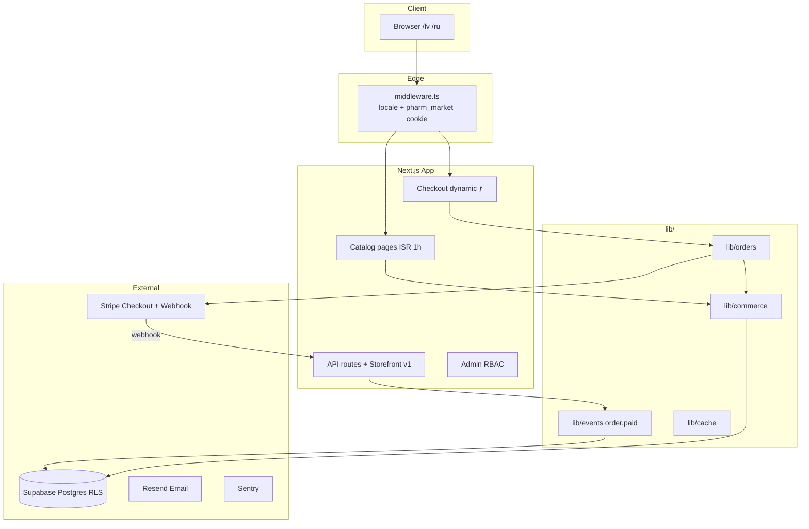
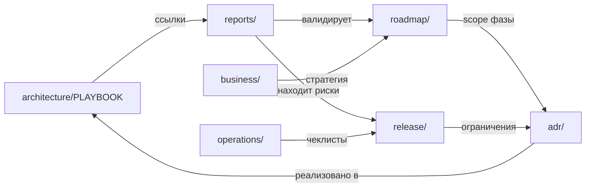

# Pharmiperia — Project Map

> Как связаны архитектура, ADR, Roadmap, Reports, Release и Business.

---

## 1. Системная архитектура (runtime)



**Источник истины по решениям:** [adr/](adr/README.md) · **Правила кода:** [architecture/ENGINEERING_PLAYBOOK.md](architecture/ENGINEERING_PLAYBOOK.md)

---

## 2. Карта документации



---

## 3. Жизненный цикл разработки

| Этап | Документы | Артефакт |
|------|-----------|----------|
| **Планирование** | [roadmap/CTO-roadmap.md](roadmap/CTO-roadmap.md), `phase-N-master-plan.md` | Scope PR |
| **Решение** | [adr/](adr/README.md) новый ADR | Зафиксированный trade-off |
| **Реализация** | [ENGINEERING_PLAYBOOK](architecture/ENGINEERING_PLAYBOOK.md) | PR + тесты |
| **Проверка** | [reports/audits/](reports/audits/README.md) | Audit verdict |
| **Закрытие фазы** | [roadmap/phase-N.md](roadmap/README.md) | Git tag `vN.0-phaseN-complete` |
| **Release Candidate** | [release/RELEASE_PROCESS.md](release/RELEASE_PROCESS.md) | Tag `v1.0.0-rc.N` |
| **Production** | [release/LAUNCH_CHECKLIST.md](release/LAUNCH_CHECKLIST.md) | Live traffic |

---

## 4. Release Process (кратко)

```
Feature PRs → phase complete → audit → RC tag → Bug Bash → ops checklist → GA tag
```

Подробно: [release/RELEASE_PROCESS.md](release/RELEASE_PROCESS.md)

| Тег | Значение |
|-----|----------|
| `vN.0-phaseN-complete` | Закрытие инженерной фазы |
| `v1.0.0-rc.1` | Release Candidate (текущий) |
| `v1.0.0` | General Availability (после Bug Bash + ops) |

---

## 5. Связь ADR ↔ фазы

| Phase | Ключевые ADR | Roadmap summary |
|-------|--------------|-----------------|
| 1 | 0008–0016 | [phase-1.md](roadmap/phase-1.md) |
| 2 | 0017–0021 | [phase-2.md](roadmap/phase-2.md) |
| 3 | 0022–0025 | [phase-3.md](roadmap/phase-3.md) |
| 4 | 0026 | [phase-4.md](roadmap/phase-4.md) |
| 5 | 0027 | [phase-5.md](roadmap/phase-5.md) |
| 6 | 0028 | [phase-6.md](roadmap/phase-6.md) |
| RC | — | [v1.0.0-rc.1.md](release/v1.0.0-rc.1.md) |

---

## 6. Связь Reports ↔ Release

| Audit | Влияние на Release |
|-------|-------------------|
| [22 Phase 6](reports/audits/22-nezavisimyj-audit-phase-6.md) | Market-aware checkout → RC code fixes |
| [23 RC](reports/audits/23-final-release-candidate-audit.md) | B-1 commit/tag, B-2 → [KNOWN_LIMITATIONS](release/KNOWN_LIMITATIONS.md) |
| [04 Production](reports/reviews/production-readiness-audit.md) | Исторический NO-GO → Phase 1 remediation |
| [11 Phase 1 validation](reports/audits/11-phase-1-production-validation.md) | `validate:production` script |

---

## 7. Business ↔ Engineering

| Business doc | Engineering link |
|--------------|------------------|
| [business-plan.md](business/business-plan.md) | Baltics expansion → Phase 6, [roadmap/CTO-roadmap.md](roadmap/CTO-roadmap.md) |
| [financial-model.md](business/financial-model.md) | Unit economics → Stripe, shipping, promo |
| [VC-due-diligence.md](business/VC-due-diligence.md) | Risk register → [reports/audits/](reports/audits/README.md) |

---

## 8. Код ↔ документация (где искать)

| Код | Документация |
|-----|--------------|
| `lib/commerce/` | ADR-0004, [phase-2](roadmap/phase-2.md), [phase-5](roadmap/phase-5.md) |
| `lib/orders.ts`, `app/actions/stripe.ts` | ADR-0005, [phase-4](roadmap/phase-4.md), audit [22](reports/audits/22-nezavisimyj-audit-phase-6.md) |
| `middleware.ts` (market cookie) | ADR-0028, [phase-6](roadmap/phase-6.md) |
| `supabase/migrations/` | Phase summaries, [MASTER_STATUS](release/MASTER_STATUS.md) |
| `scripts/validate-production.mjs` | ADR-0016, [operations/deployment.md](operations/deployment.md) |