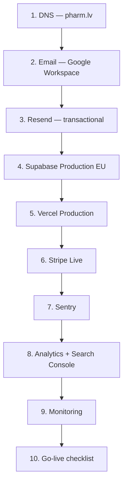

# Launch Infrastructure Pack — Pharmiperia v1.0

> **Статус:** подготовлено к ручной настройке владельцем проекта  
> **Release Candidate:** `v1.0.0-rc.2`  
> **Рынок:** LV-only v1.0  
> **Домен:** [pharm.lv](https://pharm.lv) · регистратор: [NIC.lv](https://www.nic.lv)

---

## Что это

Набор пошаговых инструкций для **внешней launch-инфраструктуры**. Кодовая часть Pharmiperia готова до `v1.0.0-rc.2` (аудит: **CONDITIONAL PASS**). Инженерных блокеров нет. Этот pack закрывает оставшиеся **ops-условия**, которые владелец настраивает вручную в сторонних сервисах.

**Важно:** ни один пункт в этом pack не считается выполненным, пока владелец не подтвердил его в [MANUAL_ACTIONS_CHECKLIST.md](./MANUAL_ACTIONS_CHECKLIST.md).

---

## Порядок выполнения (рекомендуемый)

Параллельно можно готовить Supabase и Vercel, но **DNS и email должны быть первыми** — без них не пройдут верификации Resend, Supabase Auth и Vercel domain.

---

## Документы

| Файл | Назначение |
|------|------------|
| [LAUNCH_INFRASTRUCTURE_PLAN.md](./LAUNCH_INFRASTRUCTURE_PLAN.md) | Мастер-план, зависимости, таймлайн |
| [DNS_RECORDS.md](./DNS_RECORDS.md) | Вариант A (NIC.lv) vs B (Cloudflare) |
| [EMAIL_SETUP.md](./EMAIL_SETUP.md) | ✅ Google Workspace/MX/aliases; SPF/DKIM/DMARC осталось |
| [EMAIL_INFRASTRUCTURE.md](../infrastructure/EMAIL_INFRASTRUCTURE.md) | Фактическая архитектура корпоративной почты |
| [EMAIL_PRODUCTION_SETUP.md](../infrastructure/EMAIL_PRODUCTION_SETUP.md) | Owner checklist: Resend, SPF/DKIM/DMARC, Supabase SMTP |
| [RESEND_SETUP.md](./RESEND_SETUP.md) | Transactional email для заказов и auth |
| [STRIPE_LIVE_SETUP.md](./STRIPE_LIVE_SETUP.md) | Live keys, webhook, card-only LV |
| [VERCEL_PRODUCTION_SETUP.md](./VERCEL_PRODUCTION_SETUP.md) | Домен, env, deploy rc.2 |
| [SUPABASE_PRODUCTION_SETUP.md](./SUPABASE_PRODUCTION_SETUP.md) | EU project, 25 migrations, RLS |
| [SENTRY_SETUP.md](./SENTRY_SETUP.md) | DSN, alerts, release tag |
| [ANALYTICS_SEARCH_CONSOLE_SETUP.md](./ANALYTICS_SEARCH_CONSOLE_SETUP.md) | GSC, sitemap, GA4/PostHog + consent |
| [MONITORING_SETUP.md](./MONITORING_SETUP.md) | Health endpoint, uptime alerts |
| [MANUAL_ACTIONS_CHECKLIST.md](./MANUAL_ACTIONS_CHECKLIST.md) | **Главный чеклист** всех ручных действий |

---

## Связанные документы

- [MASTER_STATUS.md](../release/MASTER_STATUS.md) — текущая стадия проекта
- [LAUNCH_CHECKLIST.md](../release/LAUNCH_CHECKLIST.md) — инженерный + ops launch gate
- [RELEASE_PROCESS.md](../release/RELEASE_PROCESS.md) — процесс релизов и фазы

---

## Быстрые рекомендации

| Решение | Рекомендация v1.0 | Подробности |
|---------|-------------------|-------------|
| DNS | **Вариант A — NIC.lv** | [DNS_RECORDS.md](./DNS_RECORDS.md) |
| Email | **Google Workspace** | [EMAIL_SETUP.md](./EMAIL_SETUP.md) |
| Когда начинать | **Сейчас** (параллельно с каталогом) | [LAUNCH_INFRASTRUCTURE_PLAN.md](./LAUNCH_INFRASTRUCTURE_PLAN.md) |
